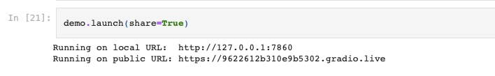
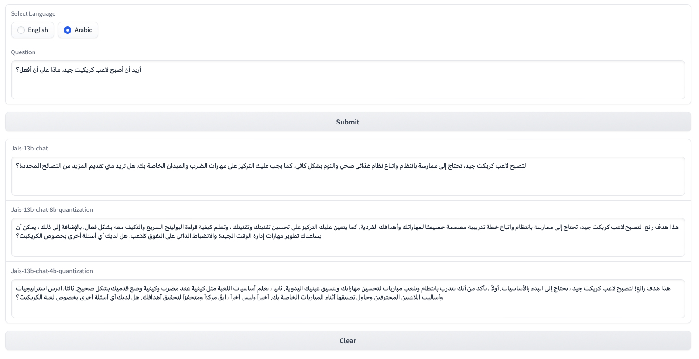

# Jais-13b-chat Bitsandbytes 8 bit and 4 bit quantization

The enclosed Jupyter Notebook shows how to make Bitsandbytes 8 bit and 4 bit quantizations for the Arabic Jais-13b-chat LLM model. The Gradio application is used to compare the accuracy of the results.

## Initial set

Setup up the virtual environment

```console
python -m venv venv
source venv/bin/activate
pip install -r requirements.txt
```

## Jais-13b-chat Bitsandbytes 8 bit

Below is the code that makes the 8 bit quantization:

```console
from transformers import AutoModelForCausalLM, BitsAndBytesConfig
model_id = "core42/jais-13b-chat"
from transformers import AutoTokenizer
import torch

quantization_config = BitsAndBytesConfig(load_in_8bit=True)
model_8bit = AutoModelForCausalLM.from_pretrained(
    model_id, 
    quantization_config=quantization_config,
    trust_remote_code=True,
    device_map="auto"
)
tokenizer = AutoTokenizer.from_pretrained(model_id)
```
The original model is 52 GB and after 8-bit quantization the size of the model is 13.6 GB.

## Jais-13b-chat Bitsandbytes 4 bit

The 4 bit quantization is make in the similar manner:

```console
from transformers import AutoModelForCausalLM, BitsAndBytesConfig
model_id = "core42/jais-13b-chat"
from transformers import AutoTokenizer
import torch

quantization_config = BitsAndBytesConfig(load_in_4bit=True)
model_4bit = AutoModelForCausalLM.from_pretrained(
    model_id, 
    quantization_config=quantization_config,
    trust_remote_code=True,
    device_map="auto"
)
tokenizer = AutoTokenizer.from_pretrained(model_id)
```
A 4-bit quantization size is 7.3 GB. The model requires 16 GB of RAM and a GPU.

## Gradio application

We use a simple Gradio application to compare the 3 models simultaneously. 

```console
# Create the Gradio application
with gr.Blocks() as demo:
    model_type = gr.Radio(choices=["English", "Arabic"], label="Select Language", value="English")
    question = gr.Textbox(label="Question", lines=3)
    submit_btn = gr.Button("Submit")
    output1 = gr.Textbox(label="Jais-13b-chat", lines=3)
    output2 = gr.Textbox(label="Jais-13b-chat-8b-quantization", lines=3, elem_classes="rtl-text")
    output3 = gr.Textbox(label="Jais-13b-chat-4b-quantization", lines=3, elem_classes="rtl-text")
    clear_btn = gr.Button("Clear")

    submit_btn.click(create_answer, inputs=[model_type, question], outputs=[output1, output2, output3])
    clear_btn.click(clear_inputs, inputs=[model_type], outputs=[model_type, question, output1, output2, output3])
```

The application can be accessed from internet:



Enclosed is an example of one prediction:



